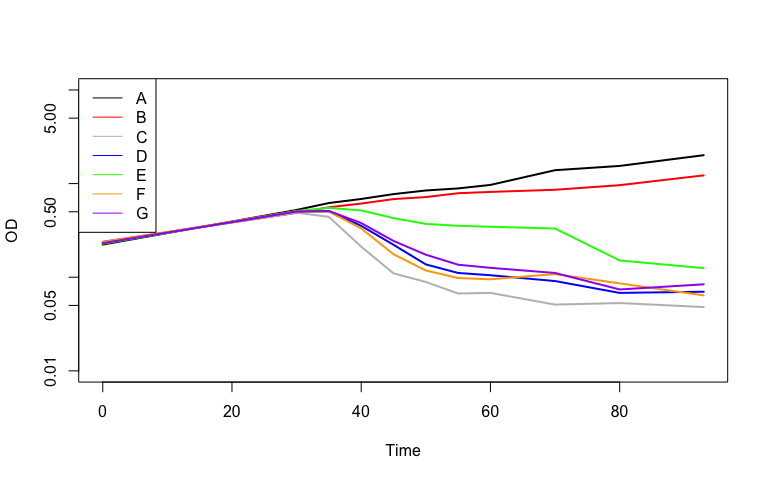
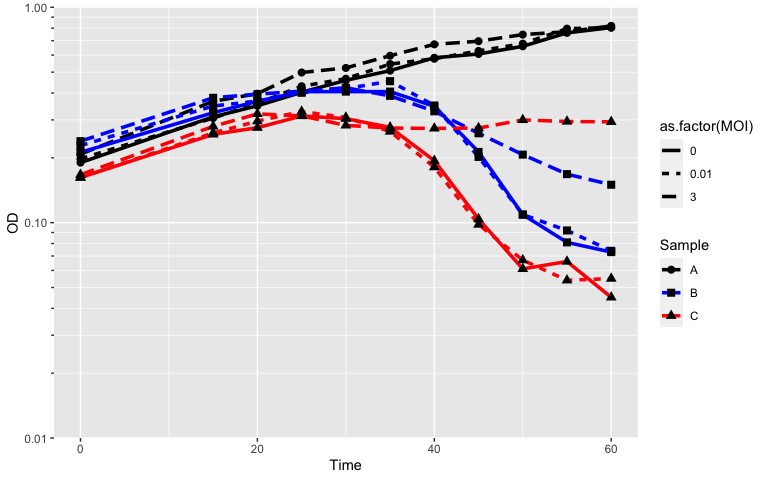
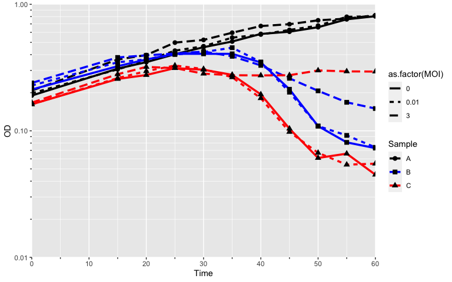
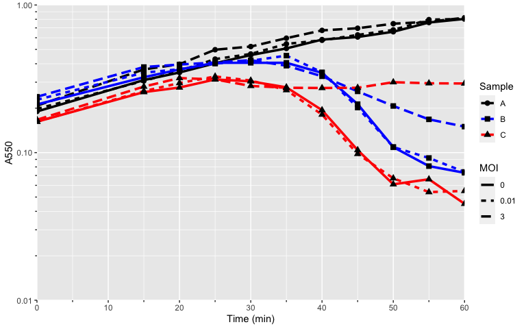
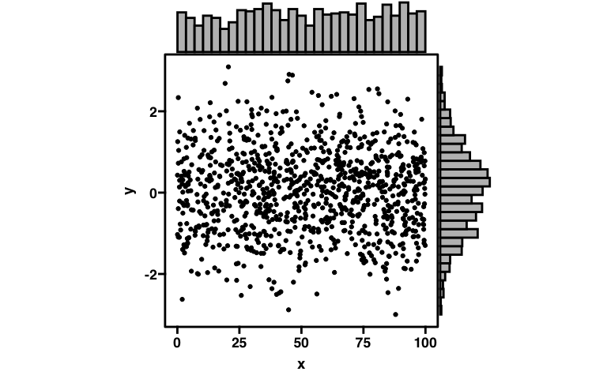
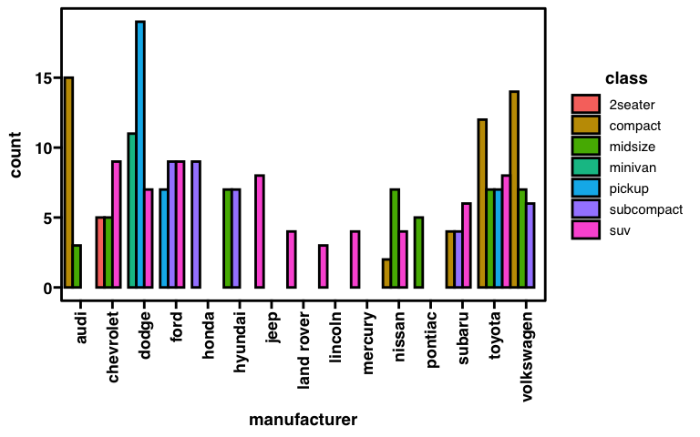

Intro to R
================
Cody Martin
5/18/2021

<div class="kable-table">

| Software | Version  |
| :------- | :------- |
| R        | 4.0.4    |
| Rstudio  | 1.2.1335 |

</div>

# Contents

  - [Introduction](#introduction)
      - [Downloads](#downloads)
      - [Basic Commands](#basic-commands)
          - [Help](#help)
          - [Math](#math)
          - [Variable assignment](#variable-assignment)
      - [Data structures](#data-structures)
          - [Vectors](#vectors)
              - [Vector Operations](#vector-operations)
              - [Subsetting vectors](#subsetting-vectors)
              - [Factor vectors](#factor-vectors)
          - [Matrices](#matrices)
              - [Subsetting matrices](#subsetting-matrices)
          - [Data frames](#data-frames)
              - [Subsetting data frames](#subsetting-data-frames)
              - [Renaming rows and columns](#renaming-rows-and-columns)
              - [Other dataframe functions](#other-dataframe-functions)
          - [Lists](#lists)
              - [Subsetting lists](#subsetting-lists)
      - [Other basic functions](#other-basic-functions)
          - [Loops](#loops)
          - [Conditional statements](#conditional-statements)
  - [Reading in data](#reading-in-data)
  - [Installing and loading packages](#installing-and-loading-packages)
  - [Plotting](#plotting)
      - [Base R plots](#base-r-plots)
          - [Scatterplots](#scatterplots)
          - [Boxplots](#boxplots)
          - [Bar plots](#bar-plots)
              - [Stacked bar plot](#stacked-bar-plot)
              - [Grouped bar plot](#grouped-bar-plot)
          - [Histograms](#histograms)
          - [Multipanel plots](#multipanel-plots)
          - [Other base plots](#other-base-plots)
      - [ggplot](#ggplot)
          - [Structing data for use in
            ggplot](#structing-data-for-use-in-ggplot)
          - [ggplot scatterplots](#ggplot-scatterplots)
              - [Lysis curves](#lysis-curves)
          - [ggplot marginal histograms](#ggplot-marginal-histograms)
          - [ggplot boxplots](#ggplot-boxplots)
          - [ggplot barplots](#ggplot-barplots)
              - [simple ggplot barplots](#simple-ggplot-barplots)
              - [stacked ggplot barplots](#stacked-ggplot-barplots)
              - [grouped ggplot barplots](#grouped-ggplot-barplots)
          - [ggplot histograms](#ggplot-histograms)

# Introduction

## Downloads

You can download the latest version of R here:
<https://cran.microsoft.com>.  
The best way to use R is with Rstudio, which you can download here:
<https://www.rstudio.com/products/rstudio/download/>.

Here is why Rstudio is so powerful: 

  - **Top left: Scripting** You can write scripts or import scripts to
    use with your own data. Here I’ve made a simple script to plot a
    normal distribution.  
  - **Bottom left: Console** Where you run R commands. If you are using
    a script, you can just run commands from the script itself. If you
    are a MacOS user, you will also have access to your UNIX Terminal.  
  - **Top right: Environment** Your environment variables will be
    displayed. Here you can see an `x` and `y` variable.
  - **Bottom right: Multipurpose** You can see:
      - Files in a given directory
      - **Plots / outputs**
      - Installed packages
      - Help instances for a given R commmand
      - Markdown outputs in “Viewer”

Having all of these windows combined together in a compact display makes
using R super powerful and efficient.

## Basic Commands

R is based on UNIX, so its syntax is **case-sensitive**. Additionally,
to run commands in your scripting window you can do a few things:

1.  Move the cursor to a line / field of code. `CMD+RET` (or
    `CTRL+ENTER`) will run an entire line or block.
2.  There is also a `run` button at the top of the scripting window.
3.  You can also highlight blocks of code you want to run and use the
    above 2 methods.

### Help

If you ever need to know more about the usage of a function, there are
two options:

1.  `?function`
2.  `help(function)`

Thus, if I wanted to know all the details of the `mean` function to get
the arithmetic mean, I could do `?mean`.

### Math

Since R was initially developed for statistics, it works very well with
standard mathematical operations.

``` r
1 + 2
```

    ## [1] 3

``` r
33 / 11
```

    ## [1] 3

``` r
8 * 15
```

    ## [1] 120

### Variable assignment

Like other object-oriented programming languages, you can assign values
to variables. Most languages use the `=` symbol to assign variables. You
will likely find that many R tutorials use the `<-` operator, but `=`
will also work in 99% of the cases. Personally, I use `=` since it is
only one keystroke.

Note: there is a shortcut for `<-`

  - MacOS: `Alt`+`-`
  - Windows: `Option`+`-`

<!-- end list -->

``` r
x = 12 
y <- "apple"
print(x)
```

    ## [1] 12

``` r
print(y)
```

    ## [1] "apple"

The only things that `<-` can do that `=` can’t do are:

1.  Directional assignment
2.  Multiple assignment in one line

<!-- end list -->

``` r
# Directional assignment...why would you do this
"a" -> z
print(z)
```

    ## [1] "a"

``` r
# Assign both x and y the value of 2
x <- y <- 2
print(x)
```

    ## [1] 2

``` r
print(y)
```

    ## [1] 2

**Note**: Most variable names containing alphanumeric symbols, `-`, and
`.` are valid. However, the variable name cannot start with a number.
There are also special commands that you should avoid naming variables
like `if`, `for`, `c`, `T`, `mean`, etc.

## Data structures

Common data structures you will find in R include:

  - Vectors of type:
      - `Character` / String /
      - `Factor` (categorical variable)
      - `Numeric` (`float` or `double` in other languages)
      - `Integer`
      - `Logical` or `boolean`
  - Matrices
  - Data frames
  - Lists

### Vectors

Vectors are collections of values of the *same* type. For example, you
can have a vector of only integers, numbers with decimals, or strings.
You can think of both data frames and matrices are collections of
vectors, so it is imperative that you are comfortable with R vectors.

You can create vectors using the `c()`. Think *concatenate* when joining
individual elements into a single vector.

You can think of vectors like lists, but that is not technically correct
since R also has a list data structure. They are more akin to single
column/row matrices. It is more like a linear algebra vector.

``` r
int_vec = c(1, 2, 3, 4, 5) # Notes commas in between entries
char_vec = c("a", "b", "tomato", "Cody") # single letters and words - all must be in quotes
num_vec = c(1.2, exp(1), 8/3)

print(int_vec)
```

    ## [1] 1 2 3 4 5

``` r
print(char_vec) 
```

    ## [1] "a"      "b"      "tomato" "Cody"

``` r
print(num_vec)
```

    ## [1] 1.200000 2.718282 2.666667

#### Vector Operations

When you have numeric vectors, you can extend math operations to the
vector elements. These operations will be performed elementwise.

``` r
# Multiply each element by a number
x = c(1, 2, 3, 4)
x * 2
```

    ## [1] 2 4 6 8

``` r
# Add 2 vectors of the same length elementwise
y = c(3.2, 1.9, 7.8, 2.2)
x + y
```

    ## [1]  4.2  3.9 10.8  6.2

``` r
# Multiply elements of 2 vectors
x * y
```

    ## [1]  3.2  3.8 23.4  8.8

You can also start to statistical operations on numeric vectors. Most
functions in R are aptly named, and Rstudio will suggest functions for
you to use as you type.

``` r
x = c(1, 2, 3, 4)
mean(x)
```

    ## [1] 2.5

``` r
sd(x)
```

    ## [1] 1.290994

``` r
median(x)
```

    ## [1] 2.5

It is very important in R to make sure your vectors are of the type that
you intended. Since vectors can only be of one type, R will coerce
vectors to a class that is compatible with all the entries.

``` r
x = c(1, 2, 3, "4") # I added a character "4" instead of the integer 4
print(x)
```

    ## [1] "1" "2" "3" "4"

``` r
class(x)
```

    ## [1] "character"

Because `x` is a `character` vector, an operation like `x * 2` will not
work\! Fortunately, you can also force R to coerce vectors to a
different type if it is able.

``` r
x = c(1, 2, 3, "4")
x = as.integer(x)
class(x)
```

    ## [1] "integer"

``` r
x * 2
```

    ## [1] 2 4 6 8

#### Subsetting vectors

You can access different elements of a vector, which is subsetting.
There are 2 major points to note with subsetting R vectors:

1.  R starts counting at 1\! Other languages will start at 0, so keep
    this in mind.
2.  The subsetting notation for **vectors** is `vector[#]`. Note the
    single `[]`. Subsetting R lists uses the double `[[]]`.

<!-- end list -->

``` r
x = c(1, 2, 3, 4)
x[2]
```

    ## [1] 2

``` r
# subset multiple entries with more vector notation!
x[c(1,3)]
```

    ## [1] 1 3

``` r
# conditional subsetting
x[c(TRUE, FALSE, FALSE, TRUE)] # can use T and F shorthand too
```

    ## [1] 1 4

``` r
x[x > 2] # only values in x that are greater than 2
```

    ## [1] 3 4

``` r
x[x == 3] # only values in x that are equal to 3
```

    ## [1] 3

You can also combine vectors together using the same `c()` command. This
is because the elements in a vector are also vectors\! They are treated
a single entry vectors.

``` r
x = c(1, 2, 3)
y = c(4, 5, 6)
c(x,y)
```

    ## [1] 1 2 3 4 5 6

Other useful functions for vectors include:

``` r
# Make a sequentially ordered numeric vector from a to b
# You can also adjust the step size or how many elementts you want
a = 1
b = 5
step = 0.5
seq(a, b, step)
```

    ## [1] 1.0 1.5 2.0 2.5 3.0 3.5 4.0 4.5 5.0

``` r
seq(a, b, length.out = 10)
```

    ##  [1] 1.000000 1.444444 1.888889 2.333333 2.777778 3.222222 3.666667 4.111111
    ##  [9] 4.555556 5.000000

``` r
# Short hand sequential vector counting by 1
1:5
```

    ## [1] 1 2 3 4 5

``` r
# repeat values
rep("a", 3)
```

    ## [1] "a" "a" "a"

``` r
rep(1:3, 3)
```

    ## [1] 1 2 3 1 2 3 1 2 3

``` r
rep(1:3, each = 3)
```

    ## [1] 1 1 1 2 2 2 3 3 3

``` r
# get length of a vector
length(1:10)
```

    ## [1] 10

#### Factor vectors

When you are working with categorical data, R has a special data class
called `Factor`. If you have categories that are composed of `character`
strings, R will understand and coerce those to `Factor` if necessary.
However, if you have numerical catergories, R will not coerce those to
`Factor` unless told to do so.

A given factor vector will be composed of unique levels. R will usually
report the levels in alphanumeric order, which will affect subsequent
commands like plotting.

``` r
colors = rep(c("red", "blue", "green"), 3)
as.factor(colors)
```

    ## [1] red   blue  green red   blue  green red   blue  green
    ## Levels: blue green red

``` r
my_categories = rep(0:2, 3)
class(my_categories) # notice it is of class integer
```

    ## [1] "integer"

``` r
# but what if 0, 1, and 2 are just categories
as.factor(my_categories)
```

    ## [1] 0 1 2 0 1 2 0 1 2
    ## Levels: 0 1 2

You can also reorder the levels of factor vectors.

``` r
colors = factor(colors, levels = c("red", "green", "blue"))
colors
```

    ## [1] red   blue  green red   blue  green red   blue  green
    ## Levels: red green blue

### Matrices

Matrices are collections of vectors, so now there are 2 dimensions.
Matrices, like vectors, can only be of a single type, which is usually
`integer`/`numeric`. Since R is for use with math, it has easy-to-use
matrix functions. Typically matrices are built from smaller vectors.

``` r
x = 1:5
y = 6:10
z = 11:15

# make a 3x5 matrix where each individual vector is a matrix row
# Note here that the order matters!
matrix(data = c(x, y, z), nrow = 3, ncol = 5, byrow = T)
```

    ##      [,1] [,2] [,3] [,4] [,5]
    ## [1,]    1    2    3    4    5
    ## [2,]    6    7    8    9   10
    ## [3,]   11   12   13   14   15

You can also just combine vectors using the functions `cbind` (column
bind) and `rbind` (row bind).

``` r
x = 1:5
y = 6:10
z = 11:15

# Note here that the order matters!
cbind(x,y,z)
```

    ##      x  y  z
    ## [1,] 1  6 11
    ## [2,] 2  7 12
    ## [3,] 3  8 13
    ## [4,] 4  9 14
    ## [5,] 5 10 15

``` r
rbind(x,y,z)
```

    ##   [,1] [,2] [,3] [,4] [,5]
    ## x    1    2    3    4    5
    ## y    6    7    8    9   10
    ## z   11   12   13   14   15

You can also combine matrices, or vectors and matrices using the same
`cbind` and `rbind` commands.

#### Subsetting matrices

Since matrices are collections of vectors, you can subset them the exact
same way. You just take into account that there are two dimensions, you
need to subset in both dimensions.

``` r
x = 1:5
y = 6:10
z = 11:15

m = matrix(data = c(x, y, z), nrow = 3, ncol = 5, byrow = T)

m
```

    ##      [,1] [,2] [,3] [,4] [,5]
    ## [1,]    1    2    3    4    5
    ## [2,]    6    7    8    9   10
    ## [3,]   11   12   13   14   15

``` r
# Cell at row 2, col 3
m[2,3]
```

    ## [1] 8

``` r
# Row 3
m[3, ]
```

    ## [1] 11 12 13 14 15

``` r
# Column 5
m[, 5]
```

    ## [1]  5 10 15

If you’ve done any linear algebra, you know that you can do matrix
operations as well. These functions are all present in R, like the
determinant `det()` and `%*%` for matrix multiplication.

### Data frames

Like matrices, data frames are collections of vectors. Unlike matrices,
however, the vectors that make up a data frame do not all have to be of
the same type, meaning you can have a data frame consisting of
`character`, `logical`, and `numeric` vectors. Data frames can use many
of the same operations as matrices.

When you combine vectors into a data frame using the `data.frame()`
commmand, the standard convention is that each combined vector will be a
column, and they must all be of the same length.

``` r
x = 1:3
y = c("a", "b", "c")
z = c(T, F, F)

data.frame(x, y, z)
```

<div class="kable-table">

| x | y | z     |
| -: | :- | :---- |
| 1 | a | TRUE  |
| 2 | b | FALSE |
| 3 | c | FALSE |

</div>

Here is a familiar looking data frame you might work with of
A<sub>550</sub> values from a lysis curve.

<div class="kable-table">

| Time | Vector | Lyser | Nonlyser |
| ---: | -----: | ----: | -------: |
|    0 |  0.200 | 0.200 |     0.20 |
|    5 |  0.308 | 0.233 |     0.25 |
|   10 |  0.417 | 0.267 |     0.30 |
|   15 |  0.525 | 0.300 |     0.35 |
|   20 |  0.633 | 0.333 |     0.40 |
|   25 |  0.742 | 0.367 |     0.45 |
|   30 |  0.850 | 0.400 |     0.50 |
|   35 |  0.958 | 0.400 |     0.55 |
|   40 |  1.067 | 0.322 |     0.60 |
|   45 |  1.175 | 0.244 |     0.65 |
|   50 |  1.283 | 0.166 |     0.70 |
|   55 |  1.392 | 0.088 |     0.75 |
|   60 |  1.500 | 0.010 |     0.80 |

</div>

#### Subsetting data frames

You can subset data frames the exact same way as matries using the
`[i,j]` notation. In addition, since the columns (and sometimes rows)
are named in data frames, you can also make use of that to subset a data
frame.

``` r
x = 1:3
y = c("a", "b", "c")
z = c(T, F, F)

df = data.frame(x, y, z)

df[1,2]
```

    ## [1] "a"

``` r
df[1,]
```

<div class="kable-table">

| x | y | z    |
| -: | :- | :--- |
| 1 | a | TRUE |

</div>

``` r
df[1:2,1:2]
```

<div class="kable-table">

| x | y |
| -: | :- |
| 1 | a |
| 2 | b |

</div>

``` r
df[,2] # column 2
```

    ## [1] "a" "b" "c"

``` r
df$y   # column 2 is also named "y" so you can grab it this way too
```

    ## [1] "a" "b" "c"

``` r
# set row names of our data frame
rownames(df) = c("a", "b", "c")
df
```

<div class="kable-table">

|   | x | y | z     |
| :- | -: | :- | :---- |
| a | 1 | a | TRUE  |
| b | 2 | b | FALSE |
| c | 3 | c | FALSE |

</div>

``` r
df["a",] # use the row name
```

<div class="kable-table">

|   | x | y | z    |
| :- | -: | :- | :--- |
| a | 1 | a | TRUE |

</div>

Other commands to subset data frames and matrices are the `head` and
`tail` commands. These will show the top `n` rows or bottom `n` rows,
respectively. The default number of rows is 6.

``` r
# data frame with 100 rows
x = 1:100
y = rnorm(100)
z = seq(0,500,length.out=100)

df = data.frame(x,y,z)

head(df)
```

<div class="kable-table">

| x |           y |         z |
| -: | ----------: | --------: |
| 1 |   0.3422248 |  0.000000 |
| 2 | \-0.3668620 |  5.050505 |
| 3 | \-1.5485837 | 10.101010 |
| 4 |   0.8111807 | 15.151515 |
| 5 |   0.8583065 | 20.202020 |
| 6 |   0.5229675 | 25.252525 |

</div>

``` r
tail(df)
```

<div class="kable-table">

|     |   x |           y |        z |
| :-- | --: | ----------: | -------: |
| 95  |  95 | \-0.0586018 | 474.7475 |
| 96  |  96 |   0.1977624 | 479.7980 |
| 97  |  97 | \-0.1371004 | 484.8485 |
| 98  |  98 |   1.4174850 | 489.8990 |
| 99  |  99 |   1.1237098 | 494.9495 |
| 100 | 100 |   0.0017009 | 500.0000 |

</div>

``` r
# show first 10 rows instead of first 6
head(df,10)
```

<div class="kable-table">

|  x |           y |         z |
| -: | ----------: | --------: |
|  1 |   0.3422248 |  0.000000 |
|  2 | \-0.3668620 |  5.050505 |
|  3 | \-1.5485837 | 10.101010 |
|  4 |   0.8111807 | 15.151515 |
|  5 |   0.8583065 | 20.202020 |
|  6 |   0.5229675 | 25.252525 |
|  7 |   1.3322395 | 30.303030 |
|  8 | \-0.2064908 | 35.353535 |
|  9 |   0.0009678 | 40.404040 |
| 10 | \-0.5959995 | 45.454546 |

</div>

#### Renaming rows and columns

Often when you import data into a `data.frame` object, the column names
will be messed up since R like them to not have spaces or special
characters. It is easy to rename them since the row and column names are
also…wait for it…vectors\! You just need to pass a new vector of names
to `colnames(data.frame)`.

``` r
x = 1:3
y = c("a", "b", "c")
z = c(T, F, F)
df = data.frame(x, y, z)
colnames(df) # notice they are the same as the vector variables
```

    ## [1] "x" "y" "z"

``` r
colnames(df) = c("red", "yellow", "blue")
df
```

<div class="kable-table">

| red | yellow | blue  |
| --: | :----- | :---- |
|   1 | a      | TRUE  |
|   2 | b      | FALSE |
|   3 | c      | FALSE |

</div>

You can also rename rows analogously. A common example would be to
change a column of names to be the row names.

``` r
Gene = c("gp01", "gp02", "gp03", "gp04")
Log2FC = rnorm(4, mean=0, sd=1)
Fitness = runif(4, min=0, max=1)

gene_data = data.frame(Gene, Log2FC, Fitness)
gene_data
```

<div class="kable-table">

| Gene |    Log2FC |   Fitness |
| :--- | --------: | --------: |
| gp01 | 0.0261435 | 0.1987459 |
| gp02 | 1.2869716 | 0.2428270 |
| gp03 | 1.4576965 | 0.1606434 |
| gp04 | 0.3124903 | 0.4191807 |

</div>

``` r
# make rownames by the Gene name
rownames(gene_data) = gene_data$Gene

# remove Gene column
gene_data$Gene = NULL
gene_data
```

<div class="kable-table">

|      |    Log2FC |   Fitness |
| :--- | --------: | --------: |
| gp01 | 0.0261435 | 0.1987459 |
| gp02 | 1.2869716 | 0.2428270 |
| gp03 | 1.4576965 | 0.1606434 |
| gp04 | 0.3124903 | 0.4191807 |

</div>

#### Other dataframe functions

These functions also apply to matrices as well.

``` r
# get dimensions of a dataframe or matrix
dim(df)
```

    ## [1] 3 3

``` r
nrow(df)
```

    ## [1] 3

``` r
ncol(df)
```

    ## [1] 3

``` r
# apply a function to a column or row
mat = matrix(1:9, nrow=3)
apply(mat, # df or matrix
      1,  # 1 = rows, 2 = columns
      mean # function to apply
      )
```

    ## [1] 4 5 6

### Lists

I like to think of lists as super vectors. Like vectors, they are
composed of different elements. Unlike vectors, those elements can be
any data structure. For example, you can have a list of a data frame,
matrix, and a vector.

Lists are very important since they keep information for an object
combined together in a hierarchical manner. Many packages will return
list objects with a ton of information in a single variable.

``` r
vec = 1:5
df = data.frame(vec,rep(T,5))
mat = cbind(vec, 6:10)
mylist = list(vec,df,mat)
mylist
```

    ## [[1]]
    ## [1] 1 2 3 4 5
    ## 
    ## [[2]]
    ##   vec rep.T..5.
    ## 1   1      TRUE
    ## 2   2      TRUE
    ## 3   3      TRUE
    ## 4   4      TRUE
    ## 5   5      TRUE
    ## 
    ## [[3]]
    ##      vec   
    ## [1,]   1  6
    ## [2,]   2  7
    ## [3,]   3  8
    ## [4,]   4  9
    ## [5,]   5 10

You can also name each element in a list.

``` r
names(mylist) = c("vector", "dataframe", "matrix")
mylist
```

    ## $vector
    ## [1] 1 2 3 4 5
    ## 
    ## $dataframe
    ##   vec rep.T..5.
    ## 1   1      TRUE
    ## 2   2      TRUE
    ## 3   3      TRUE
    ## 4   4      TRUE
    ## 5   5      TRUE
    ## 
    ## $matrix
    ##      vec   
    ## [1,]   1  6
    ## [2,]   2  7
    ## [3,]   3  8
    ## [4,]   4  9
    ## [5,]   5 10

#### Subsetting lists

This is a combination of both vector and dataframe subsetting. You can
use `[[]]` to subset a list using the index numbers, or if you have a
named list, you can use the `list$name` notation. Each element of the
list can then be subset further.

``` r
# get 1st element
mylist[[1]]
```

    ## [1] 1 2 3 4 5

``` r
# subset 1st element, a vector, further
mylist[[1]][3]
```

    ## [1] 3

``` r
# grab elements by name
mylist$dataframe
```

<div class="kable-table">

| vec | rep.T..5. |
| --: | :-------- |
|   1 | TRUE      |
|   2 | TRUE      |
|   3 | TRUE      |
|   4 | TRUE      |
|   5 | TRUE      |

</div>

``` r
# subset dataframe element further
mylist$dataframe[1:3,]
```

<div class="kable-table">

| vec | rep.T..5. |
| --: | :-------- |
|   1 | TRUE      |
|   2 | TRUE      |
|   3 | TRUE      |

</div>

## Other basic functions

### Loops

R also has standard loops like `for` and `while` loops. Here is the
syntax of an R `for` loop: `for (index in range) {command}`.

``` r
for (i in 1:5) {
  print(i)
}
```

    ## [1] 1
    ## [1] 2
    ## [1] 3
    ## [1] 4
    ## [1] 5

`while` loops have similar syntax, but rely on a condition to continue
looping.

### Conditional statements

R also has `if`, `else`, and `else if` statements to conditionally
execute functions.

``` r
x = 1:6

for (i in 1:length(x)) {
  if (x[i] > 5) {
    print(paste(x[i], "greater than 5"))
  } else if (x[i] > 2) {
    print(paste(x[i],"greater than 2"))
  } else {
    print(paste(x[i],"tiny"))
  } 
}
```

    ## [1] "1 tiny"
    ## [1] "2 tiny"
    ## [1] "3 greater than 2"
    ## [1] "4 greater than 2"
    ## [1] "5 greater than 2"
    ## [1] "6 greater than 5"

# Reading in data

R has many functions for reading in data, but the most commonly used
ones if you are using locally stored data are:

  - `read.csv()`
  - `read.delim()`
  - `read.table()` These allow you to specify the filepath to your data,
    your data delimiter, if headers are present, etc. Use `?read.csv`,
    for example, to see all the arguments that can be passed.

Here is an example reading in data from a lysis curve with OD values per
timepoint per
sample.

``` r
data = read.delim("lysis_curves/data/tabdelimited/190812_Plaque_purified_N4r-_2_infections.txt", 
                  sep = "\t")
# column names usually are disrupted
colnames(data) = c("Time (min)","MG1655","N4","N4r- 2-1","N4r- 2-2","N4r- 2-3","N4r- 2-4","N4r- 2-5")
data
```

<div class="kable-table">

| Time (min) | MG1655 |    N4 | N4r- 2-1 | N4r- 2-2 | N4r- 2-3 | N4r- 2-4 | N4r- 2-5 |
| ---------: | -----: | ----: | -------: | -------: | -------: | -------: | -------: |
|          0 |  0.223 | 0.239 |    0.237 |    0.231 |    0.228 |    0.235 |    0.231 |
|         30 |  0.523 | 0.488 |    0.489 |    0.505 |    0.510 |    0.506 |    0.504 |
|         35 |  0.620 | 0.558 |    0.441 |    0.505 |    0.550 |    0.503 |    0.510 |
|         40 |  0.685 | 0.612 |    0.212 |    0.354 |    0.517 |    0.332 |    0.379 |
|         45 |  0.772 | 0.683 |    0.110 |    0.222 |    0.428 |    0.176 |    0.244 |
|         50 |  0.844 | 0.718 |    0.089 |    0.137 |    0.371 |    0.118 |    0.174 |
|         55 |  0.888 | 0.789 |    0.067 |    0.111 |    0.354 |    0.098 |    0.136 |
|         60 |  0.968 | 0.815 |    0.068 |    0.105 |    0.346 |    0.095 |    0.126 |
|         70 |  1.390 | 0.859 |    0.051 |    0.091 |    0.331 |    0.108 |    0.111 |
|         80 |  1.544 | 0.962 |    0.053 |    0.068 |    0.151 |    0.086 |    0.074 |
|         93 |  2.010 | 1.224 |    0.048 |    0.070 |    0.125 |    0.064 |    0.084 |

</div>

Here, the `data` object is a `data.frame`. That is the usual object type
when you read in tabular data.

R and many packages also have built-in datasets that can be called by
using the variable name. If you’ve already assigned variable of the same
name to a different value, you can create the correct variable using
`data(dataset)`. One commonly used base R dataset is called `iris`. You
can use `data(iris)` to create a variable named `iris` in your
environment.

``` r
head(iris)
```

<div class="kable-table">

| Sepal.Length | Sepal.Width | Petal.Length | Petal.Width | Species |
| -----------: | ----------: | -----------: | ----------: | :------ |
|          5.1 |         3.5 |          1.4 |         0.2 | setosa  |
|          4.9 |         3.0 |          1.4 |         0.2 | setosa  |
|          4.7 |         3.2 |          1.3 |         0.2 | setosa  |
|          4.6 |         3.1 |          1.5 |         0.2 | setosa  |
|          5.0 |         3.6 |          1.4 |         0.2 | setosa  |
|          5.4 |         3.9 |          1.7 |         0.4 | setosa  |

</div>

The base R cannot interpret MS Excel `.xlsx` documents, so remove that
from your working use. Best practice is to use a universal file type
like `.txt .csv .tsv` etc.

# Installing and loading packages

R has many useful packages like `ggplot2` for making plots. To install
any packages from the publicly available CRAN repositories, just use the
command `install.packages("package_name")`. This only needs to be done
once. Alternatively, you can use the `Tools` tab in the toolbar.

Once you’ve install a package, it needs to be loaded every time you open
an R session. There are two ways to do this:

1.  `library(package)` - This is preferred. Your code will immediately
    stop if the package hasn’t been installed.
2.  `require(package)` - Will not stop immediately if the package isn’t
    installed.

You can check what packages you’ve installed in the bottom right panel
when you click the packages tab.

# Plotting

The basic R package has decent plotting functions. If you need a quick,
simple plot, it can be useful. However, `ggplot2` is far superior to
base R for many reasons incuding aesthetic, manipulation power, and
layering details. I will go over both.

## Base R plots

### Scatterplots

Use the `plot` function to make a scatterplot.

``` r
plot(x = 1:10,            # x variable
     y = 2*(1:10) + 1,    # y variable
     type = "l",          # plot type - l=line, p=point, etc
     xlab = "x",          # x axis label
     ylab = "y = 2x + 1", # y axis label 
     main = "Title",      # plot title
     xlim = c(0,10),      # adjust x limits
     ylim = c(0, 25),     # adjust y limits
     col = "red"          # change point color - can take names and hex values
) # There are more parameters that you can adjust
```


``` r
# more data from base R mtcars dataset
plot(mtcars$wt, mtcars$mpg)
```


Here is where base R sucks - if you have multiple lines you want to
plot, you will essentially need multiple lines of code to keep adding
new lines. Let’s return to my real lysis curve
data.

``` r
data
```

<div class="kable-table">

| Time (min) | MG1655 |    N4 | N4r- 2-1 | N4r- 2-2 | N4r- 2-3 | N4r- 2-4 | N4r- 2-5 |
| ---------: | -----: | ----: | -------: | -------: | -------: | -------: | -------: |
|          0 |  0.223 | 0.239 |    0.237 |    0.231 |    0.228 |    0.235 |    0.231 |
|         30 |  0.523 | 0.488 |    0.489 |    0.505 |    0.510 |    0.506 |    0.504 |
|         35 |  0.620 | 0.558 |    0.441 |    0.505 |    0.550 |    0.503 |    0.510 |
|         40 |  0.685 | 0.612 |    0.212 |    0.354 |    0.517 |    0.332 |    0.379 |
|         45 |  0.772 | 0.683 |    0.110 |    0.222 |    0.428 |    0.176 |    0.244 |
|         50 |  0.844 | 0.718 |    0.089 |    0.137 |    0.371 |    0.118 |    0.174 |
|         55 |  0.888 | 0.789 |    0.067 |    0.111 |    0.354 |    0.098 |    0.136 |
|         60 |  0.968 | 0.815 |    0.068 |    0.105 |    0.346 |    0.095 |    0.126 |
|         70 |  1.390 | 0.859 |    0.051 |    0.091 |    0.331 |    0.108 |    0.111 |
|         80 |  1.544 | 0.962 |    0.053 |    0.068 |    0.151 |    0.086 |    0.074 |
|         93 |  2.010 | 1.224 |    0.048 |    0.070 |    0.125 |    0.064 |    0.084 |

</div>

``` r
plot(data[,1], data[,2], type="l", xlab="Time", ylab="OD", 
     xlim=c(0,max(data[,1])), ylim=c(0.01,10), log="y",
     lwd=2)
lines(data[,1], data[,3], col="red", lwd=2)
lines(data[,1], data[,4], col="gray", lwd=2)
lines(data[,1], data[,5], col="blue", lwd=2)
lines(data[,1], data[,6], col="green", lwd=2)
lines(data[,1], data[,7], col="orange", lwd=2)
lines(data[,1], data[,8], col="purple", lwd=2)

# of course we want a legend
legend("topleft", # position, you can also do (x,y) coordinates
       legend = colnames(data[,-1]), # Names in legend
       lty=1,
       col=c("black", "red", "gray", "blue", "green", "orange", "purple")) # feature colors
```



That is a brute force way to add multiple lines. You could be more
sophisticated with a `for` loop, but that becomes too much work
eventually.

### Boxplots

Many of the base plotting commands take similar arguments to change
colors and other aesthetics, so now I will just focus on showing
examples.

``` r
# Simple
boxplot(iris$Petal.Length)
```


``` r
# Also group by another variable
boxplot(Petal.Length ~ Species, data = iris)
```


### Bar plots

``` r
# Plot VADeath rate among people aged 50-54
barplot(VADeaths[1,])
```


#### Stacked bar plot

Note: you can also make relative stacked bar charts using proportions or
percents, but it requires more effort with base R.

``` r
barplot(VADeaths,
         col = c("lightblue", "mistyrose", "lightcyan", 
                 "lavender", "cornsilk"),
        legend = rownames(VADeaths))
```


#### Grouped bar plot

``` r
barplot(VADeaths,
         col = c("lightblue", "mistyrose", "lightcyan", 
                 "lavender", "cornsilk"),
        legend = rownames(VADeaths), beside = TRUE)
```


### Histograms

``` r
set.seed(100) # set random seed to be same every time
x = c(rnorm(50,10,2),
      rnorm(50,50,2))
hist(x)
```


``` r
# can also change number of bins
hist(x, breaks=100)
```


### Multipanel plots

The powerhouse function to control base R plotting parameters is `par`.
I chiefly used it to assemble multipanel plots, but it can also adjust
margin sizes and many other criteria.

`mfrow` and `mfcol` will adjust the panel layout and plot by rows or
columns, respectively.

``` r
par(mfrow=c(1,3))
plot(1:10, 1:10, type="l")
boxplot(Petal.Length ~ Species, data = iris)
barplot(VADeaths,
        col = c("lightblue", "mistyrose", "lightcyan", 
                 "lavender", "cornsilk"),
        legend = rownames(VADeaths))
```


``` r
par(mfcol=c(3,1))
plot(1:10, 1:10, type="l")
boxplot(Petal.Length ~ Species, data = iris)
barplot(VADeaths,
        col = c("lightblue", "mistyrose", "lightcyan", 
                 "lavender", "cornsilk"),
        legend = rownames(VADeaths))
```


### Other base plots

You can also make a variety of other plots including:

  - Pie charts (ew)
  - Violin plots / 1D scatterplots by group
  - Density plots
  - QQ-plots

In addition, you can add information with confidence intervals to your
plots. The base R plotting is fairly powerful for getting all the
information you want on a plot, but modifying aesthetics becomes very
difficult.

## ggplot

You will first need to install this using `install.packages("ggplot2")`,
then load the package using `library(ggplot2)`. Something to note is
that the syntax of making a `ggplot` is different from base R, so you
will need to get some practice.

Another **HUGE** benefit of the `ggplot2` package is that it is super
popular, which means there are many packages built on top of it to get
full customization. Some useful ones include:

1.  `ggprism` - Stylize your plots to look like they were made in
    graphpad prism
2.  `ggrepel` - Useful text / label repelling so it doesn’t overlap
3.  `ggExtra` - Add plots in the margins to show distributions of x and
    y variables.
4.  `gridExtra` - Arrange multiple ggplots together into a single
    figure.

### Structing data for use in ggplot

The big power of using `ggplot` is that it can stylize your plots with
minimal code. The catch is that your data needs to be vertically
structured instead of the more inuitive horizontal structure. Here’s
what I mean. Let’s take my lysis data again.

Here is my lysis data horizontally
structured:

<div class="kable-table">

| Time (min) | MG1655 |    N4 | N4r- 2-1 | N4r- 2-2 | N4r- 2-3 | N4r- 2-4 | N4r- 2-5 |
| ---------: | -----: | ----: | -------: | -------: | -------: | -------: | -------: |
|          0 |  0.223 | 0.239 |    0.237 |    0.231 |    0.228 |    0.235 |    0.231 |
|         30 |  0.523 | 0.488 |    0.489 |    0.505 |    0.510 |    0.506 |    0.504 |
|         35 |  0.620 | 0.558 |    0.441 |    0.505 |    0.550 |    0.503 |    0.510 |
|         40 |  0.685 | 0.612 |    0.212 |    0.354 |    0.517 |    0.332 |    0.379 |
|         45 |  0.772 | 0.683 |    0.110 |    0.222 |    0.428 |    0.176 |    0.244 |
|         50 |  0.844 | 0.718 |    0.089 |    0.137 |    0.371 |    0.118 |    0.174 |
|         55 |  0.888 | 0.789 |    0.067 |    0.111 |    0.354 |    0.098 |    0.136 |
|         60 |  0.968 | 0.815 |    0.068 |    0.105 |    0.346 |    0.095 |    0.126 |
|         70 |  1.390 | 0.859 |    0.051 |    0.091 |    0.331 |    0.108 |    0.111 |
|         80 |  1.544 | 0.962 |    0.053 |    0.068 |    0.151 |    0.086 |    0.074 |
|         93 |  2.010 | 1.224 |    0.048 |    0.070 |    0.125 |    0.064 |    0.084 |

</div>

This is **NOT** suitable for use with `ggplot`. (Actually it can work,
but it’s more complicated.)

Here is the same lysis data vertically structured (only first 13 rows).

<div class="kable-table">

| Time |    OD | Sample |
| ---: | ----: | :----- |
|    0 | 0.223 | MG1655 |
|   30 | 0.523 | MG1655 |
|   35 | 0.620 | MG1655 |
|   40 | 0.685 | MG1655 |
|   45 | 0.772 | MG1655 |
|   50 | 0.844 | MG1655 |
|   55 | 0.888 | MG1655 |
|   60 | 0.968 | MG1655 |
|   70 | 1.390 | MG1655 |
|   80 | 1.544 | MG1655 |
|   93 | 2.010 | MG1655 |
|    0 | 0.239 | N4     |
|   30 | 0.488 | N4     |

</div>

Notice how every row is a **SINGULAR** observation. It is the OD at one
timepoint with the sample. Suppose you had something more complicated
like ± DNP addition. You could add a fourth column with that
information.

If you are going to commit to using `ggplot`, you should either stop
making horizontal tables, or (**preferred method**) just write code to
switch horizontal data to vertical data.

### ggplot scatterplots

``` r
library(ggplot2)
# Note that the variables in the aes() are column names in the iris dataset
ggplot(data = iris, aes(x = Petal.Length, y = Petal.Width)) +
  geom_point(aes(color = Species), size=2) +
  xlim(0,8) +
  ylim(0,3) +
  labs(x="Petal Length",
       y="Petal Width",
       title="Scatterplot",
       color="Species") +
  theme_bw()
```


You can also fit lines to scattersplots and display the confidence
intervals of the lines fairly easily using `geom_smooth`. To display
your regression equations, you will need more statistics to get the
formulas, but you could display those if you wanted.

``` r
library(ggplot2)
library(ggprism)

set.seed(100)
x = seq(-10, 10, length.out = 100)
y = 2 * x^2 + 4 + rnorm(100, 0, sd = 50) # model y = 2x^2 + 4 but with some random noise
df = data.frame(x,y)

ggplot(df, aes(x,y)) +
  geom_point() +
  geom_smooth(formula = y ~ poly(x, 2), method = "lm", se=T) +
  theme_prism(border=T, palette = "colors") + # theme like prism plot
  coord_cartesian(clip = "off") +
  theme(aspect.ratio = 1/1)
```


#### Lysis curves

Here is how to plot a beautiful lysis curve.

``` r
library(ggplot2)
library(ggprism)
library(ggrepel)

data = read.csv("lysis_curves/data/190812_Plaque_purified_N4r-_2_infections.csv")

# define custom offset to move line labels away from axis
offset = max(data$Time)*0.025
# ggprism has default colors to use, but I want to reorder them
cols = ggprism_data$colour_palettes$colors[c(6,1:5,7:20)]

# custom minor ticks on y-axis for log scale
y_minor = rep(1:9, 3)*(10^rep(-2:0, each=9))

ggplot(data = data, aes(x = Time, y = OD)) +
  geom_line(aes(color = Sample), size=1.25) + 
  geom_point(aes(shape = Sample), size=2.5, fill="black", na.rm = T) +
  geom_text_repel(data = subset(data, Time == max(data$Time)), # labels next to lines
                  aes(label = Sample, 
                      color = Sample, 
                      x = Inf, # put label off plot
                      y = OD), # put label at same height as last data point
                  direction = "y",
                  xlim = c(max(data$Time)+offset, Inf), # offset labels
                  min.segment.length = Inf, # won't draw lines
                  hjust=0, # left justify
                  size=5,
                  fontface="bold") + # move it away from the axis
  scale_shape_prism(palette = "default") + # use prism defined shapes
  scale_color_manual(values = cols) + # use my reordered prism colors
  scale_y_log10(limits=c(0.01, 10), # convert y-axis to log10 scale
                guide=guide_prism_minor(), 
                minor_breaks=y_minor,
                expand=c(0,0)) + 
  scale_x_continuous(breaks=seq(0,max(data$Time),10), 
                     guide=guide_prism_minor(),
                     expand=c(0,0)) + 
  labs(x="Time (min)",
       y="A550") +
  theme_prism(border=T, palette = "colors") + # theme like prism plot
  coord_cartesian(clip = "off") +
  theme(aspect.ratio = 1/1, 
        legend.position = "none", 
        plot.margin = unit(c(1,5,1,1), "lines"))
```


Here’s a more complicated lysis curve.

``` r
library(ggplot2)
library(ggprism)

data = read.csv("lysis_curves/data/201029_CCM_N4_addition_to_plasmid-encoded_lysis_causes_LIN.csv")

# ggprism has default colors to use, but I want to reorder them
cols = ggprism_data$colour_palettes$colors[c(6,1:5,7:20)]

# custom minor ticks on y-axis for log scale
y_minor = c(rep(1:9, 2)*(10^rep(c(-2, -1), each=9)), 1)

ggplot(data = data, aes(x = Time, y = OD)) +
  geom_line(aes(color = factor(Sample, levels = c("pRE", "gp60-62", "gp60-63")), # change order R will plot them
                linetype = as.factor(MOI)), size=1.25) + 
  geom_point(aes(shape = factor(Sample, levels = c("pRE", "gp60-62", "gp60-63"))), 
                 size=2.5, fill="black", na.rm = T) +
  scale_shape_prism(palette = "default") + # use prism defined shapes
  scale_color_manual(values = cols) + # use my reordered prism colors
  scale_y_log10(limits=c(0.01, 1), # convert y-axis to log10 scale
                guide=guide_prism_minor(), 
                minor_breaks=y_minor,
                expand=c(0,0)) + 
  scale_x_continuous(breaks=seq(0,max(data$Time),10), 
                     guide=guide_prism_minor(),
                     expand=c(0,0)) + 
  labs(x="Time (min)",
       y="A550",
       color="Sample",
       shape="Sample",
       linetype="MOI") + # rename MOI legend title
  theme_prism(border=T, palette = "colors") + # theme like prism plot
  coord_cartesian(clip = "off") +
  theme(aspect.ratio = 1/1, 
        legend.title = element_text())
```


Let’s break down all these commands. `ggplot()` just draws a plot
background and the frame. Setting the `data = data` indicates that the
data being used is the data frame named `data` I made containing my
lysis curve data.

The aesthetics of the plot are passed to the `aes()` command. `aes`
takes arguments for:

  - x
  - y
  - color
  - fill
  - shape
  - linetype So that you can customize you plot appearance by different
    groups of data.

<!-- end list -->

``` r
library(ggplot2)
ggplot(data = data, aes(x = Time, y = OD))
```


`geom_line()` will add lines to plot `Time` against `OD`. Notice that I
added `aes(color = ...)`. This allows us to color the lines by the
samples. Without that argument, only one giant mess of lines would be
plotted.

``` r
library(ggplot2)
ggplot(data = data, aes(x = Time, y = OD)) +
  geom_line(aes(color = factor(Sample, levels = c("pRE", "gp60-62", "gp60-63")),
                linetype = as.factor(MOI)), size=1.25)
```


`geom_point()` will also add bullet points at each time point. Notice
that we can adjust the shape to match the sample type as well.

``` r
library(ggplot2)
ggplot(data = data, aes(x = Time, y = OD)) +
  geom_line(aes(color = factor(Sample, levels = c("pRE", "gp60-62", "gp60-63")),
                linetype = as.factor(MOI)), size=1.25) +
  geom_point(aes(shape = factor(Sample, levels = c("pRE", "gp60-62", "gp60-63"))), 
                 size=2.5, fill="black", na.rm = T)
```


There are also many other `geom` arguments you can add depending on your
plot type. I will show examples of these later. Notice they take other
arguments to adjust sizes and constant color changes.

Now let’s tell `ggplot` how to work with our `aes` settings by changing
`scales`. First, we can change the shapes we use for our bullets to be
defined by the `ggprism` package.

``` r
library(ggplot2)
library(ggprism)
ggplot(data = data, aes(x = Time, y = OD)) +
  geom_line(aes(color = factor(Sample, levels = c("pRE", "gp60-62", "gp60-63")),
                linetype = as.factor(MOI)), size=1.25) +
  geom_point(aes(shape = factor(Sample, levels = c("pRE", "gp60-62", "gp60-63"))), 
                 size=2.5, fill="black", na.rm = T) +
  scale_shape_prism(palette = "default")
```


Next, we can change how `ggplot` will color anything passed to a `color`
argument. I custom defined a vector of colors called `cols` based on
`ggprism` colors.

``` r
library(ggplot2)
library(ggprism)
ggplot(data = data, aes(x = Time, y = OD)) +
  geom_line(aes(color = factor(Sample, levels = c("pRE", "gp60-62", "gp60-63")),
                linetype = as.factor(MOI)), size=1.25) +
  geom_point(aes(shape = factor(Sample, levels = c("pRE", "gp60-62", "gp60-63"))), 
                 size=2.5, fill="black", na.rm = T) +
  scale_shape_prism(palette = "default") +
  scale_color_manual(values = cols)
```


Then we can also change how the axes are structured. First, I want to
make the y-axis on log10 scale. I can supply the end points with the
`limits` and change the minor ticks using the `guides` and
`minor_breaks` arguments. Finally, `ggplot` automatically leaves 5% of
space on each end of each axes. Aesthetically, I do not like this
usually, so I use the `expand` command to reduce that 0%.

``` r
library(ggplot2)
library(ggprism)
ggplot(data = data, aes(x = Time, y = OD)) +
  geom_line(aes(color = factor(Sample, levels = c("pRE", "gp60-62", "gp60-63")),
                linetype = as.factor(MOI)), size=1.25) +
  geom_point(aes(shape = factor(Sample, levels = c("pRE", "gp60-62", "gp60-63"))), 
                 size=2.5, fill="black", na.rm = T) +
  scale_shape_prism(palette = "default") +
  scale_color_manual(values = cols) +
  scale_y_log10(limits=c(0.01, 1),
                guide=guide_prism_minor(), 
                minor_breaks=y_minor,
                expand=c(0,0))
```


We can also change the scaling of the x axis too. I like to only have
x-axis go from the start to end time without any extra space, but this
currently looks very strange. It will need more commands to continue
looking better.

``` r
library(ggplot2)
library(ggprism)
ggplot(data = data, aes(x = Time, y = OD)) +
  geom_line(aes(color = factor(Sample, levels = c("pRE", "gp60-62", "gp60-63")),
                linetype = as.factor(MOI)), size=1.25) +
  geom_point(aes(shape = factor(Sample, levels = c("pRE", "gp60-62", "gp60-63"))), 
                 size=2.5, fill="black", na.rm = T) +
  scale_shape_prism(palette = "default") +
  scale_color_manual(values = cols) +
  scale_y_log10(limits=c(0.01, 1),
                guide=guide_prism_minor(), 
                minor_breaks=y_minor,
                expand=c(0,0)) +
  scale_x_continuous(breaks=seq(0,max(data$Time),10), 
                     guide=guide_prism_minor(),
                     expand=c(0,0))
```


We can add labels to the axes, plot titles, and any legend titles. Note:
legend titles are the same variables as variables passed to the `aes`
function.

``` r
library(ggplot2)
library(ggprism)
ggplot(data = data, aes(x = Time, y = OD)) +
  geom_line(aes(color = factor(Sample, levels = c("pRE", "gp60-62", "gp60-63")),
                linetype = as.factor(MOI)), size=1.25) +
  geom_point(aes(shape = factor(Sample, levels = c("pRE", "gp60-62", "gp60-63"))), 
                 size=2.5, fill="black", na.rm = T) +
  scale_shape_prism(palette = "default") +
  scale_color_manual(values = cols) +
  scale_y_log10(limits=c(0.01, 1),
                guide=guide_prism_minor(), 
                minor_breaks=y_minor,
                expand=c(0,0)) +
  scale_x_continuous(breaks=seq(0,max(data$Time),10), 
                     guide=guide_prism_minor(),
                     expand=c(0,0)) +
  labs(x="Time (min)",
       y="A550",
       color="Sample",
       shape="Sample",
       linetype="MOI") 
```



`ggplot` has many themes to change the way the entire plot looks,
especially the plot backgrounds. I like to use `theme_prism` to stylize
my plots like graphpad prism. Additionally, I like to have borders
around the entire graph and specifiy the prism colors to use.

``` r
library(ggplot2)
library(ggprism)
ggplot(data = data, aes(x = Time, y = OD)) +
  geom_line(aes(color = factor(Sample, levels = c("pRE", "gp60-62", "gp60-63")),
                linetype = as.factor(MOI)), size=1.25) +
  geom_point(aes(shape = factor(Sample, levels = c("pRE", "gp60-62", "gp60-63"))), 
                 size=2.5, fill="black", na.rm = T) +
  scale_shape_prism(palette = "default") +
  scale_color_manual(values = cols) +
  scale_y_log10(limits=c(0.01, 1),
                guide=guide_prism_minor(), 
                minor_breaks=y_minor,
                expand=c(0,0)) +
  scale_x_continuous(breaks=seq(0,max(data$Time),10), 
                     guide=guide_prism_minor(),
                     expand=c(0,0)) +
  labs(x="Time (min)",
       y="A550",
       color="Sample",
       shape="Sample",
       linetype="MOI") +
  theme_prism(border=T, palette = "colors")
```



Notice how the points at the min and max values on the x-axis are hidden
underneath the plot itself. We can fix this by changing `clip = "off"`
in the `coord_cartesian()` function.

``` r
library(ggplot2)
library(ggprism)
ggplot(data = data, aes(x = Time, y = OD)) +
  geom_line(aes(color = factor(Sample, levels = c("pRE", "gp60-62", "gp60-63")),
                linetype = as.factor(MOI)), size=1.25) +
  geom_point(aes(shape = factor(Sample, levels = c("pRE", "gp60-62", "gp60-63"))), 
                 size=2.5, fill="black", na.rm = T) +
  scale_shape_prism(palette = "default") +
  scale_color_manual(values = cols) +
  scale_y_log10(limits=c(0.01, 1),
                guide=guide_prism_minor(), 
                minor_breaks=y_minor,
                expand=c(0,0)) +
  scale_x_continuous(breaks=seq(0,max(data$Time),10), 
                     guide=guide_prism_minor(),
                     expand=c(0,0)) +
  labs(x="Time (min)",
       y="A550",
       color="Sample",
       shape="Sample",
       linetype="MOI") +
  theme_prism(border=T, palette = "colors") +
  coord_cartesian(clip = "off")
```



For the final aesthetic changes, I like to have square plots, so I
change the `aspect.ratio` in the `theme()` function. Additionally,
`theme_prism()` automatically hides all legend titles, so we need to
unhide those using `legend.title = element_text()` to specify that the
title needs to be a text element instead of a blank element
(`element_blank()`).

``` r
library(ggplot2)
library(ggprism)
ggplot(data = data, aes(x = Time, y = OD)) +
  geom_line(aes(color = factor(Sample, levels = c("pRE", "gp60-62", "gp60-63")),
                linetype = as.factor(MOI)), size=1.25) +
  geom_point(aes(shape = factor(Sample, levels = c("pRE", "gp60-62", "gp60-63"))), 
                 size=2.5, fill="black", na.rm = T) +
  scale_shape_prism(palette = "default") +
  scale_color_manual(values = cols) +
  scale_y_log10(limits=c(0.01, 1),
                guide=guide_prism_minor(), 
                minor_breaks=y_minor,
                expand=c(0,0)) +
  scale_x_continuous(breaks=seq(0,max(data$Time),10), 
                     guide=guide_prism_minor(),
                     expand=c(0,0)) +
  labs(x="Time (min)",
       y="A550",
       color="Sample",
       shape="Sample",
       linetype="MOI") +
  theme_prism(border=T, palette = "colors") +
  coord_cartesian(clip = "off") +
  theme(aspect.ratio = 1/1, 
        legend.title = element_text())
```


### ggplot marginal histograms

Suppose you have a scatterplot and you want to show the distribution of
each variable in addition. Use the `ggExtra` package.

``` r
library(ggplot2)
library(ggprism)
library(ggExtra)

set.seed(100) # set a random seed
# x is generated from a uniform distribution from 0 to 100
x = runif(1000, 0, 100)
# y is generated from a normal distribution with mean 0 and sd 1
y = rnorm(1000)
df = data.frame(x,y)

g = ggplot(df, aes(x, y)) +
      geom_point() +
      theme_prism(border=T) +
      coord_cartesian(clip = "off") +
      theme(aspect.ratio = 1/1)
ggMarginal(g, type = "histogram", fill = "gray", lwd=1)
```


### ggplot boxplots

You can easily rotate these by changing `Petal.Length` to be on the
y-axis.

``` r
library(ggplot2)
library(ggprism)

# simple box plot
ggplot(iris, aes(x = Petal.Length)) +
  geom_boxplot(size=1) +
  theme_prism(border=T) +
  coord_cartesian(clip = "off") +
  theme(aspect.ratio = 1/1)
```


``` r
# box plot faceted by another variable
ggplot(iris, aes(x = Petal.Length, y = Species)) +
  geom_boxplot(size=1) +
  theme_prism(border=T) +
  coord_cartesian(clip = "off") +
  theme(aspect.ratio = 1/1)
```


### ggplot barplots

#### simple ggplot barplots

``` r
library(ggplot2)
library(ggprism)
data(mpg, package = "ggplot2")

ggplot(mpg, aes(manufacturer)) +
  geom_bar(size=1, col="black", fill="gray") +
  theme_prism(border=T) +
  coord_cartesian(clip = "off") +
  theme(aspect.ratio = 1/1,
        axis.text.x = element_text(angle = 90, hjust = 1)) # needed to rotate x labels
```



#### stacked ggplot barplots

We can do both stacked with the raw counts

``` r
library(ggplot2)
library(ggprism)
data(mpg, package = "ggplot2")

ggplot(mpg, aes(manufacturer)) +
  geom_bar(aes(fill=class), position = "stack", # these two arguments are required
           size=1, col="black") +
  theme_prism(border=T) +
  coord_cartesian(clip = "off") +
  theme(aspect.ratio = 1/1, legend.title = element_text(),
        axis.text.x = element_text(angle = 90, hjust = 1)) # needed to rotate x labels
```


and percent stacked bar charts very easily with `ggplot`. You don’t have
to format your data to already contain the percent values either, which
you do with base R. Here, `ggplot` will calculate the values for you.

``` r
library(ggplot2)
library(ggprism)
data(mpg, package = "ggplot2")

ggplot(mpg, aes(manufacturer)) +
  geom_bar(aes(fill=class), position = "fill", # these two arguments are required
           size=1, col="black") +
  theme_prism(border=T) +
  coord_cartesian(clip = "off") +
  theme(aspect.ratio = 1/1, legend.title = element_text(),
        axis.text.x = element_text(angle = 90, hjust = 1)) # needed to rotate x labels
```


#### grouped ggplot barplots

Normally you can just set `position = "dodge"`, but if you have groups
that don’t have all the sub groups, then all the bars will not be
constant width. For example, Jeeps only have SUVs in this dataset, so
the bar there will be larger. I do not find that aesthetically pleasing,
so I use `position = position_dodge(preserve = "single")`.

``` r
library(ggplot2)
library(ggprism)

data(mpg, package = "ggplot2")

ggplot(mpg, aes(manufacturer)) +
  geom_bar(aes(fill=class), position = position_dodge(preserve = "single"),
           size=1, col="black", width = 1) +
  theme_prism(border=T) +
  coord_cartesian(clip = "off") +
  theme(legend.title = element_text(),
        axis.text.x = element_text(angle = 90, hjust = 1)) # needed to rotate x labels
```


### ggplot histograms

You can more easily control the number of bins or the binwidth in a
`ggplot` histogram here.

``` r
library(ggplot2)
library(ggprism)

set.seed(100) # set random seed to be same every time
x = c(rnorm(50,10,2),
      rnorm(50,50,2))
df = data.frame(x)

ggplot(df, aes(x)) +
  geom_histogram(fill="gray", col="black", bins = 50) +
  theme_prism(border=T) +
  coord_cartesian(clip = "off") +
  theme(aspect.ratio = 1/1)
```


Suppose now that you have information about a circular genome, and a
circular histogram would accurately display that information…of course,
`ggplot` can do this.

``` r
library(ggplot2)
genome = 4e6 # 4 Mb genome like E.coli and B. subtilis
set.seed(100) # set random seed for reproducibility
genomic_features = sample(genome, size = 5000, replace = T)
genome_data = data.frame(genomic_features)

myhist = ggplot(genome_data, aes(genomic_features)) +
            geom_histogram(binwidth=50000, fill="gray", col="black")

min_y = -max(ggplot_build(myhist)$data[[1]]$count)/3 # make lower bound 1/3 magnitude of max
max_y = max(ggplot_build(myhist)$data[[1]]$count)

circhist = myhist +
  coord_polar() +
  ylim(min_y, max_y) +
  theme_minimal() +
  theme(
      axis.text = element_blank(),
      axis.title = element_blank(),
      panel.grid = element_blank(),
      plot.margin = unit(rep(-0.7,4), "cm"))

circhist
```


